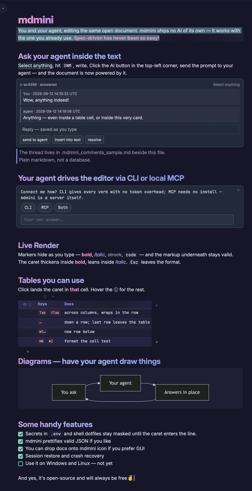

# mdmini

A markdown editor for macOS where you and your AI agent work in the same open document. The agent opens a file, scrolls to a line, pushes an edit straight into the live buffer, or asks you a question inside the text — and you can comment back on any fragment and have it answered in place.

mdmini contains no AI of its own and talks to no cloud. It exposes a local Unix socket and a stdio MCP server; the intelligence is whatever agent you already use — Claude Code, or anything that speaks MCP or can run a shell command. Nothing leaves your machine.

[](https://github.com/malinborn/mdmini/releases)
[](LICENSE)
[](https://github.com/malinborn/mdmini/stargazers)

**[Website](https://md-mini.com)** · **[Releases](https://github.com/malinborn/mdmini/releases)** · **[AI interface reference](docs/ai-interface.md)**



## Install

```bash
brew tap malinborn/mdmini
brew trust malinborn/mdmini
brew install --cask mdmini
```

Or download the universal `.dmg` from [Releases](https://github.com/malinborn/mdmini/releases) — one build for Apple Silicon and Intel.

Upgrade later with:

```bash
brew update && brew upgrade --cask mdmini
```

### Known limitation: macOS asks for folder access again after an update

Expected, and not something an update can avoid. mdmini is ad-hoc signed — no Apple Team ID — so macOS identifies it by a code hash that changes with every release. After `brew upgrade`, the permission you granted to Documents or Desktop belongs to what macOS considers a different app, and it asks once more.

Fixing it properly means Developer ID signing and notarization, which costs $99/year. mdmini is free and open source, and that is not a bill it is going to carry. Granting access again after an upgrade is the whole of the workaround.

## Open files

```bash
mdmini                    # empty editor
mdmini README.md          # open a file
mdmini file1.md file2.md  # one window per file
```

You can also launch it from Spotlight or the Dock, and drop files onto the Dock icon.

## Connect your agent

### Over MCP

```bash
claude mcp add --scope user mdmini -- mdmini mcp
```

`mdmini mcp` is a stdio [MCP](https://modelcontextprotocol.io) server exposing `show`, `edit` and `ask` as tools. For other MCP clients:

```json
{
  "mcpServers": {
    "mdmini": {
      "command": "mdmini",
      "args": ["mcp"]
    }
  }
}
```

Run `mdmini agent --mcp` to print a short usage-culture block worth pasting next to it.

### Over the CLI

Every operation is also a plain shell verb, so an agent that can run commands needs no MCP support at all:

```bash
mdmini show notes.md --line 42            # focus the window and pulse-highlight line 42
mdmini show notes.md --find "## Deploy"   # same, by first text match
cat new.md | mdmini edit notes.md --show  # push the complete new document into the live buffer
mdmini ask notes.md --question "Ship it?" --option Yes --option No
```

`edit` takes the **whole** new document on stdin, never a diff: mdmini diffs it against what is on screen, applies only the changed spans and highlights them. Your scroll position survives, and the edit is a normal history step — `⌘Z` is how you reject it, `Esc` clears the highlight. Each verb prints one line of JSON and sets an exit code.

`mdmini agent` prints a paste-ready block for a project's `CLAUDE.md`, `AGENTS.md` or equivalent. `mdmini help` prints the full verb reference offline.

### Comments: asking your agent back

Select a fragment, press `⇧⌘M`, write a question. The thread lives in `.mdmini_comments_<file>.md` beside the document — plain markdown you can read, hand-edit and diff in git. mdmini only ever appends to it, and never touches the document itself, so a full-document `edit` from an agent cannot destroy a comment.

```bash
mdmini question                                  # list open threads
echo "because X" | mdmini answer notes.md --id c-7f3a2c
mdmini watch                                     # one line per newly-open thread
```

These three verbs read and write the sidecar directly, so they work with the app closed and from agents that have no MCP at all.

With Claude Code, `AI → Connect Agent to Doc Questions` copies a prompt that arms `mdmini watch` as a Monitor: a new comment interrupts the session that already has your context, instead of spawning a fresh one that knows nothing. The reply arrives back in the thread; if it asks for a change rather than an answer, **insert into text** folds it into the document as a normal AI edit.

The comment box is always editable and saves as you type, so a half-written thought survives a crash, a reload, and the agent answering mid-sentence. The agent is not woken until you have been quiet for 20 seconds, with the countdown running inside the send button so you can cut it short. Threads re-anchor by the text around them, not by the first occurrence of the quote, so a card lands where it was written even after the document moves underneath it.

Everything the AI menu can do is described under `AI → Getting Started`. Full protocol, JSON contract, exit codes and troubleshooting: [`docs/ai-interface.md`](docs/ai-interface.md).

## The editor

**Live Preview** — markdown renders inline and the syntax reappears under the caret. No split pane, no preview toggle.

**Live Render (beta)** — `View → Editor Engine → (beta) Live Render`. Markers stay hidden even under the caret, Notion-style. Typing after a bold word continues the bold; `Esc` or the format shortcut ends it; the caret itself shows the active format — thicker for bold, slanted for italic, a crossbar for strikethrough, serifs for inline code. Option+arrows and Option+Backspace step over the hidden markers, and a repair layer writes a marker pair back when an edit tears one, so the file on disk stays valid markdown. Search in this mode runs against the source rather than the screen, which is its main rough edge today.

**Tables** — GFM tables render as aligned widgets. A click parks the caret in the cell you clicked; `Tab` moves across columns, `↵` down rows and out of the last one. Cell text selects, copies, takes bold/italic/code and takes comments. Rows and columns reorder by dragging the `⠿` handle, and hover gives `+`/`−` buttons. The `ⓘ` beside the wrap toggle lists every key.

**Code blocks** — syntax highlighting for 100+ languages, with a language label and a Copy button. Click in to edit, click away to render.

**Mermaid diagrams** — flowcharts, sequence, class, state, ER, Gantt, pie, gitgraph and mindmap render as inline SVG. Lazy-loaded, theme-aware, pinch to zoom and drag to pan.

**Collapsible headings** — hover a heading for its fold toggle; six levels you can tell apart by size and colour.

**JSON** — `⇧⌘J` re-indents the text you gave it rather than re-serializing it, so big integers, `1e5`, `3.0` and duplicate keys survive byte for byte. Pasting JSON into a markdown file offers to drop it in a fenced block.

**`.env` and shell configs** — values of secret-looking keys (`PASSWORD`, `TOKEN`, `API_KEY`, …) are masked in `.env` files and in `.zshrc`/`.bashrc`-style dotfiles. Putting the caret on a line reveals that line, the Copy button copies the real value, and `⌘E` reveals the whole file.

**Code files** — `.py`, `.rs`, `.json`, `.yaml` and the rest open with native syntax highlighting instead of markdown rendering.

**File watching** — external changes are reloaded automatically, keeping your scroll position and caret. Useful when an agent writes to the file directly rather than through `mdmini edit`.

**Durable saving** — writes are atomic, and the file's mode, owner, group, ACLs and extended attributes are carried across the replacement. Editing through a symlink writes to what the link points at. A crash mid-write leaves the old file or the new one, never a truncated one; a write the filesystem refuses raises a toast instead of failing silently.

**Session restore** — `⇧⌘T` reopens the windows you had last time: files, geometry, scroll, caret and unsaved drafts.

**Themes** — Light and Dark (Rosé Pine Dawn and Rosé Pine), an Aurora light/dark pair, and System.

## Keyboard shortcuts

### Files and windows

| Shortcut | Action |
|----------|--------|
| `⌘N` | New window |
| `⌘O` | Open… |
| `⌘S` | Save |
| `⇧⌘S` | Save As… |
| `⌘W` | Close window |
| `⇧⌘T` | Reopen windows from last session |

### Editing

| Shortcut | Action |
|----------|--------|
| `⌘B` | Bold |
| `⌘I` | Italic |
| `⇧⌘X` | Strikethrough |
| `Esc` | End the format you are typing in (Live Render); clear an AI edit highlight |
| `Tab` / `⇧Tab` | Indent / outdent the selected list items |
| `/` | Slash commands — insert a block |
| `⌘F` | Find and replace |
| `⌘A` | Select all |
| `⇧⌘J` | Format JSON |
| `⌘K` | Focus the element inspector — link URL, code fence language (Live Render) |
| `⌘`-click | Open a rendered link in the browser (a plain click puts the caret in its text) |

### View

| Shortcut | Action |
|----------|--------|
| `⌘E` | Toggle raw markdown — a three-way cycle if you tick `View → Include Live Render in Cmd+E` |
| `⌘+` / `⌘−` / `⌘0` | Zoom in / out / reset |

### AI

| Shortcut | Action |
|----------|--------|
| `⇧⌘M` | Comment on the selection |
| `Esc` | Dismiss the highlight on an AI edit |
| `⌘Z` | Undo an AI edit like any other |

### Inside a table cell

| Shortcut | Action |
|----------|--------|
| `Tab` / `⇧Tab` | Column right / left, wrapping within the row |
| `↵` | Next row, same column — and out of the table on the last row |
| `⇧↵` | Line break inside the cell |
| `⌘↵` | Apply the edit |
| `⇧⌘↵` | New row below |
| `Esc` | Discard the edit |

## Development

Requires Node 22, a stable Rust toolchain and the Xcode command line tools.

```bash
npm install
npm run dev        # frontend only — Vite on http://localhost:1420, open it in a browser
npm run tauri dev  # the full app, with file I/O, the native menu and the AI socket
```

Most of mdmini is frontend: the editor, decorations and mermaid all run in a plain browser context, so `npm run dev` is enough for most work. If port 1420 is stuck from a previous session: `lsof -ti:1420 | xargs kill -9`.

`npm run dev:app` and `npm run build:dev` build under a separate identifier (`md-mini-dev`), with their own bundle id, socket and data directory — use them when you need the native shell but have a production mdmini installed and running.

### Checks

```bash
npm run test                                       # Vitest
npm run check                                      # Svelte + TypeScript
cargo test --manifest-path src-tauri/Cargo.toml    # Rust
cargo clippy --manifest-path src-tauri/Cargo.toml  # Rust lints
```

### Build

```bash
npm run tauri build                                 # .dmg for this machine's architecture
rustup target add aarch64-apple-darwin x86_64-apple-darwin
npm run build:universal                             # the universal .dmg releases ship
```

### Layout

```
src-tauri/src/   Rust: IPC commands, native menu, windows, file watcher,
                 session restore, crash recovery, AI command socket, MCP server
src/lib/editor/  CodeMirror 6: keymaps, slash commands, folding,
                 preview/ decorations, live-render/ beta mode
src/lib/tauri/   IPC wrappers and event listeners
site/            the md-mini.com landing page
docs/            design specs, plans and the AI interface reference
```

## Tech stack

[Tauri 2](https://v2.tauri.app) · [Svelte 5](https://svelte.dev) · [CodeMirror 6](https://codemirror.net) · [Lezer](https://lezer.codemirror.net) markdown with GFM · [Mermaid](https://mermaid.js.org) · Vite

## License

[GPL-3.0](LICENSE)
