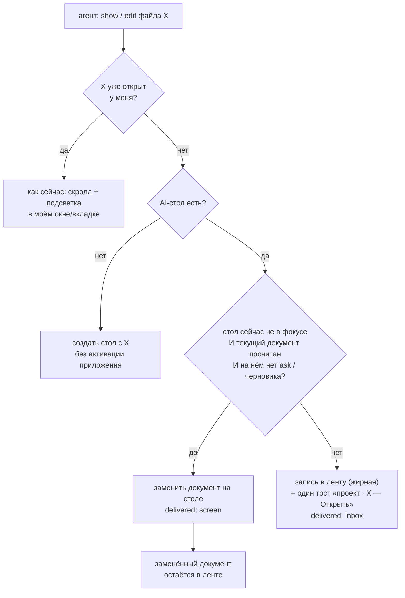

# Вкладки в couplet: варианты, страхи, жертвы

*2026-09-23 · исследование + 3 прожарки + прожарка прожарок · код не менялся (кроме одноразового спайка в отдельном worktree)*

## TL;DR

- **Корень твоего страха — не вкладки, а то, что их открывает ИИ.** Сейчас каждый `show` нового файла = новое окно; в табах это превратится ровно в «Claude Code в VS Code»: вкладка на каждую правку, «fills the editor with stale diff tabs» (там это стабильная жалоба, выключить нельзя).
- **Принцип couplet-way: агент не владеет местом в интерфейсе.** Вкладки создаёт только человек. У всех агентов вместе — **одно** место, «AI-стол» (отдельное окно), и одно правило: **непрочитанное не вытесняется**. Всё, что не попало на стол, — в ленте, с подписью «проект/ветка».
- **Закрывать не страшно, потому что закрытие обратимо:** файлы автосейвятся, untitled никогда не теряется, ⌘⇧T возвращает закрытое, всё агентское лежит в ленте.
- **Путь:** (1) фундамент — он чинит **баги, которые есть уже сегодня**, делать в любом случае; (2) однодневный спайк нативных вкладок с жёсткими критериями; (3) один релиз «Вкладки + AI-стол» — на нативных вкладках, если спайк зелёный, иначе на своих (B-lite).
- **Чем жертвуем:** два агентских документа рядом — только через «Оставить»; агент больше не может показать документ поверх твоей работы; в нативном варианте — системный вид полосы, в своём — фоновые вкладки не живые.
- **Внизу 5 решений, которые можешь принять только ты**, у каждого есть дефолт.

---

## 1. Что выяснили

### Побочная находка: баги, которые есть сейчас (без всяких вкладок)
Замена документа внутри окна (Cmd+O, Recent Files) сломана. Подтверждено двумя независимыми проверками по коду и скриптом на CM6:

| Баг | Где | Последствие |
|---|---|---|
| Undo не сбрасывается при смене документа | `Editor.svelte:60-71` (`addToHistory(false)`) | Cmd+Z после Cmd+O может вписать кусок **старого** документа в новый, автосейв записывает это в файл |
| Cmd+W на untitled | `lib.rs:307-311` → `prune_untitled_files` | текст пропадает молча (+ коллизия `untitled-main.md` между запусками) |
| `ask` при смене документа | `ai-ask.ts:216-222` | вопрос в середине исчезает, агент висит до таймаута (300 с); вопрос в конце переезжает в чужой документ |
| Нет dedup в Cmd+O | `App.svelte:249-268` | один файл в двух окнах, оба автосейвят |
| Нет flush автосейва при смене | оба пути | последние ≤300 мс набора теряются |
| Recent Files | `stores.svelte.ts:324-338` | окна перетирают список друг друга; агентские `show` вымывают 10 слотов за минуты |

Это всё чинится в «фундаменте» (раздел 5, шаг 1) и нужно при любом решении про вкладки.

### Индустрия (кратко; полная выжимка — `2026-09-23-tabs/research-web.md`)
- **Анти-разрастание:** VS Code preview tabs + лимит LRU (жалоба №1: «моя вкладка пропала»); Zed preview tabs; TextMate сам закрывает давно неиспользованные при переполнении; JetBrains лимит 10; Arc архивирует незакреплённые через 12 ч (реакция: «тревожно» и «освобождает» одновременно); Safari/Chrome — автозакрытие/«предлагаем закрыть».
- **Минималистичные md-редакторы:** iA Writer и MarkEdit — нативные macOS-вкладки; Typora — без вкладок (просят с 2016); BBEdit — список «открытых документов» вместо вкладок.
- **ИИ:** Zed Agent Panel не плодит вкладки — все правки агента в **одном** представлении; Little Arc — внешнее открывается во временной поверхности, в «постоянное» переносится явно.
- **Исследования (CHI 2021, CHI 2010):** вкладки копят (а) как напоминание/todo, (б) из «эффекта чёрной дыры» — «как только скрылось из виду, пропало». Лечится тем, что у закрытого есть **видимое место**, откуда оно возвращается одной клавишей.

### Спайк нативных вкладок (реальная сборка, dev-идентификатор)
- Сливает окна во вкладки только явный `addTabbedWindow` (одного `tabbingIdentifier` мало).
- **AppKit-вызов не с main thread тихо убивает процесс** — открытие 5 файлов через single-instance упало. Лечится `run_on_main_thread` (AI-путь уже так делает).
- ~58 MB на вкладку (свой WebContent-процесс) — **столько же, сколько сейчас стоит окно**.
- Window-меню с системными «Merge All Windows / Show All Tabs» — одна константа `WINDOW_SUBMENU_ID`.
- Скриншоты полосы снять не удалось (нет Screen Recording) — вид, мигание, `●` в заголовке вкладки **не проверены**.

---

## 2. Принцип: агент не владеет местом

Первая версия дизайна давала каждому агенту свою вкладку-«полосу» с историей. Прожарка №2 посчитала: ~20 механизмов (идентичность агента, история, повышение до «моей», точки непрочитанного, очереди, фальшивые ack, дедлайны, сворачивание…) — и все компенсируют одно решение: **агенту дали место в интерфейсе**. У тебя 8 живых сессий → 8 вечных полос → тот же Chrome, только с потолком. Это тот самый запах «как будто хуйня получается».

Убираем фундамент — механика уходит:

- **Вкладки = файлы, и только от твоего намерения** (⌘T, ⌘O, Finder, твой CLI, drag-drop, «Оставить» из ленты).
- **У всех агентов одно место — AI-стол** (отдельное окно, переиспользуется).
- **Одно правило — «непрочитанное не вытесняется».**
- **Всё агентское — в одной хронологической ленте**, видимой, с подписью «проект/ветка» (не id сессии).

Почему «непрочитанное не вытесняется», а не «60 секунд без активности» (так было в v4): 8 агентов + ты минуту в терминале → вернулся, а отчёта, который шёл читать, уже нет. Три булевых флага вместо таймера. Режим «только стучаться, никогда не переключать» — настройкой.

---

## 3. Как закрываем каждый страх

| Страх | Чем закрываем | Что остаётся честно |
|---|---|---|
| **Тонна вкладок** | Агенты вкладок не создают. Вкладок = сколько ты сам открыл. | Если твоих станет много — можно добавить TextMate-лимит (закрывать давно неиспользованные чистые). В v1 не надо. |
| **Страшно закрыть** | Закрытие без потерь: автосейв, untitled → черновики, ⌘⇧T возвращает закрытое (а в свежем запуске — прошлую сессию), всё агентское в ленте. «Закрыть остальные» безопасно. | Undo закрытой вкладки не возвращается (файл — да). |
| **Невозможно держать в порядке** | Вкладки в порядке открытия (новая справа от текущей). Агентское — одна хронология с подписями, дедуп по пути, ~50 записей. «Где план со вторника» → лента. | Лента не заменяет файловый менеджер; сортировки/поиска в v1 нет. |
| **Забивают окно** | Полоса видна только при ≥2 твоих вкладках. Стол — отдельное окно, не вкладка (иначе полоса была бы видна всегда). | Одно дополнительное окно (стол). |
| **ИИ должен хорошо работать** | Одно место, честный статус (`delivered: screen/inbox`), агент говорит тебе в чате, где лежит документ. `ask` не на экране → тост «Ответить». Комментарии (`question/answer/watch`) не затронуты — они через файлы. | Агент не может навязать показ, пока ты занят (это фича). Старые MCP-процессы не увидят новое поле до перезапуска сессий. |
| **Компоновка по окнам** | Твои вкладки — во фронтальном окне; «Переместить в новое окно» — командой (в нативном — ещё и жестом). ИИ — только на стол. Окон-на-проект нет (иначе вместо tab sprawl — window sprawl). | — |

---

## 4. Варианты реализации вкладок

| | **A. Нативные macOS** | **B-lite. Свои, живая только активная** | **B. Свои, все живые** | **C. Без полосы (свитчер)** | **0. Только стол, без вкладок** |
|---|---|---|---|---|---|
| Суть | вкладка = окно + WKWebView, группировка системой | одно окно, вкладка = `{путь, позиция, EditorState}`, живёт только активная | все документы живые без view | B-lite без видимой полосы, ⌘P/⌃Tab | AI-стол + лента, свои документы — окнами как сейчас |
| Фоновые вкладки | **живые** (watcher, ответы на комменты, `edit` с подсветкой) | не живые: сверка при возврате, `edit` в кешированный state | живые | как B-lite | — |
| Вид | системный, не кастомизируется | свой, минимальный, можно в titlebar | свой | ничего на экране | ничего нового |
| Жесты / обзор | drag между окнами, ⌘⇧\, Merge — бесплатно | «В новое окно» только командой | командой | — | — |
| Доступность | бесплатно | `role=tablist`, клавиатура — руками | руками | руками | — |
| Память | ~58 MB/вкладку (= статус-кво) | ≈0 | ≈0 | ≈0 | как сейчас |
| Главный риск | objc на main thread (тихая смерть процесса), проверяется только на бандле | утечки через переключение (оверлеи, паузы комментариев, упавшее сохранение) — проверяется в браузере | headless-переписывание комментариев (~700 строк хрупкого кода) | «чёрная дыра»: не видно, что открыто | ты не получишь вкладок |
| Объём поверх фундамента (на глаз) | ~1k строк | ~1.2–1.6k + тесты | 3–5k | как B-lite | ~0.6–0.9k |
| Вердикт | **да, если спайк зелёный** | **запасной план** | нет | только как режим потом | нет: ты просил вкладки; стол идёт вместе с ними |

Почему A снова в игре: прожарки №1–2 отбросили его по доводам эпохи «полос» (13 вкладок × 58 MB, свои маркеры непрочитанного). В новом принципе вкладок 3–6, маркеры не нужны, память равна сегодняшней. А главное — A **бесплатно** делает фоновые вкладки живыми, то есть стирает всю компенсирующую механику B-lite (кеш, сверка с диском, очереди, «edit в обход экрана»). Остаётся риск objc — это конечный аудит четырёх мест, его и проверяет спайк.

---

## 5. Рекомендуемый путь

### Шаг 1. Фундамент (отдельный PR, можно сейчас)
- `switchDocument()` — единственный путь смены документа: flush автосейва → dedup → untitled с текстом в черновики → **свежий EditorState** (закрывает утечку undo) → коммит пауз комментариев → отмена/перенос `ask` по (окно, путь) → закрыть оверлеи → режим по типу файла → нельзя уйти с документа с упавшим сохранением.
- Untitled никогда не теряется; имя черновика по uuid, а не по label окна.
- Recent и «недавно закрытые» — в Rust (не localStorage). ⌘⇧T = вернуть закрытое; в свежем запуске — прошлую сессию.
- Нужен **в любом варианте** и чинит баги из раздела 1. ~8–10 файлов, ~1–1.5k строк.

### Шаг 2. Спайк нативных вкладок (1 день), критерии зелёного
- все NSWindow-вызовы через `run_on_main_thread`; открытие из IPC, single-instance, restore — без падений;
- скриншоты полосы: как выглядит `●`, заголовок, мигание при слиянии (нужно выдать терминалу Screen Recording или посмотреть глазами);
- restore группы вкладок в правильном порядке; fullscreen (баг tauri #6548);
- стол — окно вне группы вкладок.
Зелёный → A. Красный → B-lite.

### Шаг 3. Один релиз «Вкладки + AI-стол»
- вкладки для твоих файлов (A или B-lite), ⌘T, ⌘1…9, ⌘W = закрыть вкладку, Window-меню;
- AI-стол: отдельное окно, без активации приложения, правило «непрочитанное не вытесняется», один тост-стук (тост того же вида заменяет предыдущий — встроенный анти-спам);
- лента = отдельная секция в Recent (Rust, дедуп по пути, ~50), пункт меню + хоткей;
- `show` отвечает `delivered: "screen" | "inbox"`; обновить описание инструмента («inbox — это успех, не повторяй, скажи человеку, где лежит»), сниппеты агента и **твой скилл mdmini** — он сейчас открывает файлы как человек (`mdmini file.md`), и без правки агенты будут плодить вкладки;
- session v2 (`session-v2.json`, старый не трогаем, миграция v1→v2).
Отдельно стол без вкладок не выпускаем — это будет выглядеть как «опять не сделали».

### Связь с ребрендингом
- Recent в Rust — **до** ребрендинга (localStorage живёт в `~/Library/WebKit/<identifier>`, который ребрендинг меняет).
- Session v2 и миграцию каталога данных — **в разных релизах**.
- Смену контракта `show` — **вместе** с ребрендингом: MCP всё равно перерегистрируют, сессии агентов перезапустятся, и проблема «старые MCP-процессы выбрасывают новое поле» решится сама.

### Что сознательно вырезали
| Идея | Почему нет |
|---|---|
| Вкладка-полоса на каждого агента | ~20 компенсирующих механизмов, 8 вечных полос, история за поповером = чёрная дыра |
| Автозакрытие по LRU/таймеру (Arc, TextMate) в v1 | агентские открытия выселяли бы твою заметку; без агентских вкладок не нужно |
| Стол как вкладка | полоса была бы видна всегда |
| «60 секунд без активности» | стол мельтешит, отчёт пропадает, пока ты в терминале |
| Лента как md-файл | красиво (агенты без MCP могли бы дописывать), но гонки записи; вернуться потом |
| Dock bounce, абсолютные дедлайны ask | громче, чем ты выбирал раньше; лишняя механика |
| Окно на проект | вместо tab sprawl — window sprawl |

---

## 6. Чем жертвуем (итог)
1. **Два агентских документа рядом** — только через «Оставить» (⌘↩ → твоя вкладка).
2. **Автономия агента:** он не может показать поверх твоей работы; иногда ответит «лежит в ленте» вместо «показал».
3. **A:** системный вид полосы (без кастомных маркеров), objc-риск, проверка только на бандле. **B-lite:** нет жестов между окнами и ⌘⇧\, фоновые вкладки не живые (ответ агента на комментарий в фоновом документе увидишь при переключении), undo фоновой вкладки теряется, если файл поменяли снаружи.
4. **Переходный период:** пока сессии агентов не перезапущены, они не знают про `delivered`.
5. **Undo закрытой вкладки** не возвращается (файл и позиция — да).
6. **Исходный принцип спеки «No tabs»** — отменяем осознанно.

---

## 7. Решения за тобой (дефолт — первый вариант)
1. **Нативные вкладки (A, если спайк зелёный) или свои (B-lite)?** Можно решить, посмотрев на скриншоты из спайка.
2. **`show` на стол:** «непрочитанное не вытесняется» **или** всегда только стук?
3. **Стол:** отдельное окно **или** вкладка?
4. **Агентский `mdmini file.md`** (путь твоего скилла): на стол (скилл переводим на `show`) **или** пусть открывает вкладки?
5. **Порядок с ребрендингом:** фундамент и Recent в Rust — до, контракт `show` — вместе с ребрендингом **или** всё сразу?

---

## Как шла прожарка
| Этап | Что изменил |
|---|---|
| Черновик v1–v2 (я) | «вкладка — место, а не файл», полосы агентов, страховочная сетка |
| Прожарка №1 (архитектор, по коду) | нашёл баги замены документа; ключ агента из env, а не git root; ⌘[ ⌘] заняты; реальная цена A |
| Прожарка №1b (архитектор) | B-lite: живая только активная вкладка; ловушки таймаутов, упавшего сохранения, невидимых ask |
| Прожарка №2 (продукт, твоими глазами) | снесла полосы: корень механики — «агент владеет местом»; предложила один AI-стол и ленту |
| Прожарка №3 (прожарка прожарок) | перепроверила факты; вернула A (его отбросили по устаревшим доводам); «60 с» → «непрочитанное не вытесняется»; нашла дыру контракта в старых MCP-процессах, обход через скилл, связь с ребрендингом |

Материалы (черновики, все прожарки, спайк, веб-выжимка): `docs/investigations/2026-09-23-tabs/`. Спайк нативных вкладок лежит незакоммиченным в worktree `agent-acf7ff122c5eda2d6` (throwaway).

### Источники (главные)
- Chang et al., *When the Tab Comes Due*, CHI 2021 — https://dl.acm.org/doi/10.1145/3411764.3445585
- Dubroy & Balakrishnan, CHI 2010 — https://www.dgp.toronto.edu/~ravin/papers/chi2010_tabbedbrowsing.pdf
- VS Code editor limit — https://code.visualstudio.com/updates/v1_42
- Zed Agent Panel / multibuffers — https://zed.dev/docs/ai/agent-panel, https://zed.dev/docs/multibuffers
- Arc Auto-Archive / Little Arc — https://resources.arc.net/hc/en-us/articles/19228855311127
- iA Writer tabs — https://ia.net/topics/ia-writer-mac-with-tabs
- TextMate hidden settings (tab auto-close) — https://github.com/textmate/textmate/wiki/Hidden-Settings
- Claude Code diff-tab complaints — https://github.com/anthropics/claude-code/issues/25018
- Tauri tabbing bug #6548 — https://github.com/tauri-apps/tauri/issues/6548
- CM6 multiple docs — https://discuss.codemirror.net/t/cm6-multiple-docs-with-their-own-histories/3220
