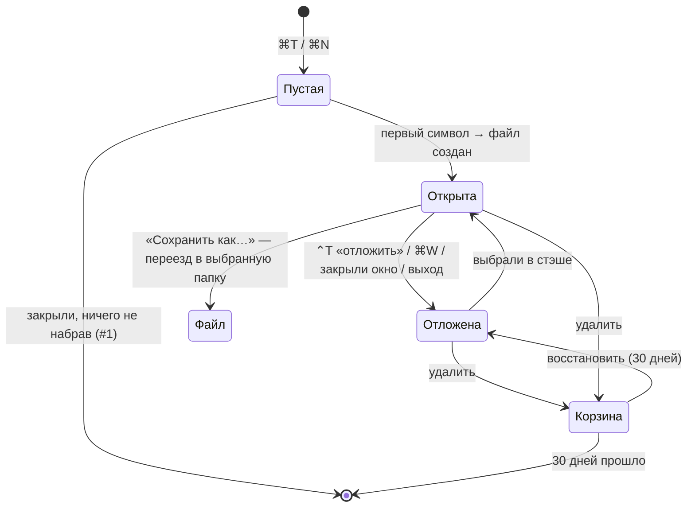

# Стэш в couplet — исследование и решения

> Начато 2026-09-26. Повод: после `brew upgrade` (2.0.0 → 2.0.1) пропал untitled с планами. Задача: couplet сам хранит документы без имени, их нельзя потерять, и человеку не нужно думать, куда и под каким именем сохранять.
>
> Версия 2: добавлены заметки Max из блокнота (раздел 1), его решения и правило для файлов. Термин «полка» заменён на «стэш».
>
> Версия 3: хранение — SQLite как источник правды, текст заметок в `.md`-файлах (4.3); интерфейс — два дровера и зона сброса внизу (4.5); дедупликация (4.1).
>
> Версия 4: по макету v2 — дроверы никогда не перекрываются, в узком окне компактны, а слишком узкое окно само раздвигается; открытое вкладкой в окне не показывается в его стэше (4.5). Быстрые теги отложены (4.4). Фаза 0 объяснена заново (5). Макет: `docs/investigations/2026-09-26-stash-mockup/stash-drawers.html`.

## Коротко

- **Нужно, и это не выдумка.** Эту боль уже лечили BBEdit (Notes в версии 14 — прямой ответ на «у меня висит 300+ untitled»), Drafts, Apple Notes и iA Writer. У VS Code и Zed были такие же потери untitled на «перезапуске для обновления».
- **Решено (Max):**
  - все документы по умолчанию лежат в стэше: хрупкого untitled больше нет;
  - отдельный жест «отложить» убирает документ с глаз, но оставляет его в стэше под рукой;
  - стэш общий для всего приложения, с тегами, и окно проекта само фильтрует стэш по тегу своего репо;
  - агент видит стэш через методы list / get / add;
  - **хранение:** SQLite — источник правды для стэша (записи, теги, ссылки), текст заметок лежит `.md`-файлами, путь к ним записан в БД;
  - **интерфейс:** внизу дровера вкладок — область стэша с кнопкой; кнопка открывает справа второй дровер своего цвета, оба открыты одновременно; пока тащишь вкладки, нижняя область превращается в зону сброса «в стэш»;
  - **дедупликация:** один и тот же документ, отложенный из разных окон, — одна запись.
- **Правило для файлов (предложено, Max принял к записи):** стэш хранит заметки и ссылки на файлы. Тег на файле = отложить его в стэш. Сами файлы couplet не меняет.
- **До стэша стоит сделать фазу 0:** сборщик мусора сессии больше не удаляет черновики, а переносит их в корзину. Это полдня работы, и это уже спасло бы план.

## 1. Заметки Max из блокнота (расшифровка)

*Два эскиза, #1 и #2: окно с хлястиком на левом краю, в нём карточки. У #1 карточек три и хлястик крупнее, у #2 — компактнее.*

**Where does Stash live in UX?**
- stash modes? with different colouring?
- hotkey for sure
- /command

**Obvious features**
1. Delete untitled if there is nothing
2. Stash is global — git-wise stash? *(стрелка от пометки «like autotags via repo=tag»)*
3. Stash should be easily accessible by AI. Definitely need methods for listing it, get, add to stash
4. Mark "stashed" in tabs drawer and window header
5. Stash "tags" — you can mark your stash with tags and filter it with them via tags
6. When the window is dedicated to a repo, it should autofilter stash with its repo-tag
7. One note could be tagged with multiple tags
8. Fast tags with hotkeys — like cmd+⇧+t, +[number]
9. Embedding for stash as an extension? As a plugin maybe or smth like that
10. Two modes of drawer, or stash as a window in carousel for moving tabs across windows? Both ways are interesting, need to try it

> Do I really need a possibility to open stash along with the drawer?

## 2. Что сломалось и почему это типовая ошибка

Untitled в couplet — это вкладка с `path: null`, чей текст лежит в `session/draft-<tab_id>.md`. Раз в секунду couplet сохраняет сессию и **удаляет все черновики, на которые она больше не ссылается** (`prune_untitled_files`, `lib.rs:417`). Если при обновлении, миграции или падении хоть одна ссылка потерялась, сборщик мусора превращает это в удаление данных. Копии нет.

Так же падали и другие:

| Приложение | Где держало untitled | Что случилось |
|---|---|---|
| VS Code [#69972](https://github.com/microsoft/vscode/issues/69972), [#70247](https://github.com/microsoft/vscode/issues/70247) | бэкапы, найденные через метаданные сессии | после «Restart to Update» вкладки Untitled вернулись пустыми |
| Zed [#30665](https://github.com/zed-industries/zed/discussions/30665) | SQLite, привязка к воркспейсу | «lost many months of unsaved buffers». Данные остались в базе, пропала только ссылка на них |
| Sublime Text | прямо внутри файла сессии | файл сессии сломался — буферы пропали вместе с ним |

Общее у всех: **пользовательский текст живёт как часть состояния сессии.** Надёжное хранилище так не устроено.

## 3. Как это делают те, кто решил задачу

| | Имя | Где хранится | Как открыть список | Удаление | Выход в файл |
|---|---|---|---|---|---|
| **BBEdit Notes** (ближайший аналог) | из начала текста, `Rename Note` фиксирует | обычные `.md` в пакете в Application Support | отдельное окно с сайдбаром, видны в ⌘D, поиск | в системную Корзину | Save A Copy, Export Notes |
| **Drafts** | первая строка | БД + CloudKit | боковая панель со встроенным поиском | Trash на 30 дней | share / actions |
| **Apple Notes / Bear** | первая строка | БД | сайдбар | Recently Deleted на 30 дней | экспорт |
| **iA Writer** | первая строка → имя файла | обычные файлы в Library | File List | обычное удаление | это и так файлы |
| **Notational Velocity** | заголовок = строка поиска | БД или plain-файлы | одно поле: поиск и создание | — | — |
| **Obsidian Unique note** | timestamp `202609260215` | `.md` в vault | обычный файловый список | — | это и так файлы |
| **Tot** | нет, 7 фиксированных точек | локально + iCloud | одно окно в menu bar | нет | share как .txt |

Мелочь из BBEdit, которую стоит украсть: **«Rescue untitled documents when discarding changes»** — даже после «Не сохранять» снимок текста всё равно остаётся на диске.

## 4. Модель стэша

### 4.1 Две сущности: заметки и ссылки на файлы

| | Заметка | Файл |
|---|---|---|
| Где лежит текст | в папке стэша, им владеет couplet | там, где был; couplet его не трогает |
| Как попадает в стэш | сама, с первого символа | явно: «отложить» или поставить тег |
| Что хранит стэш | файл + метаданные | только ссылку: путь, теги, каретку, дату |
| Удалить из стэша | текст уходит в корзину на 30 дней | удаляется только ссылка, файл остаётся на месте |
| Тег репозитория | запоминается при создании (проект окна) | вычисляется сам из git toplevel пути |

Правила:
- **Тег = отложено.** Тегу нужно где-то жить: поставил тег файлу — файл появился в стэше. Отдельного решения «застэшить файл» нет.
- **Открытый файл сам в стэш не попадает**, иначе стэш станет копией Recent Files. Автоматически в стэше только заметки, файлы попадают туда по жесту человека.
- **Теги не пишутся внутрь файлов**, никакого frontmatter. Файл пользователя остаётся байт-в-байт тем же, иначе git покажет diff от couplet. Метаданные лежат в базе стэша (4.3).
- **Дедупликация (Max).** У файла ключ — нормализованный путь (`path_norm`), то же правило «один файл — одна запись», что у вкладок; в базе это уникальный индекс. У заметки дубль невозможен в принципе: она уже в стэше, и «отложить» ставит отметку, а не создаёт копию. Повторный стэш уже лежащего документа ничего не добавляет: поднимает его наверх, сливает теги, обновляет каретку. Известная дыра: `path_norm` не сворачивает регистр, а APFS к регистру нечувствителен, так что `A.md` и `a.md` пока две записи.
- **Виды различаются иконкой**, а «удалить» у файла подписано «убрать из стэша». Так никто не испугается, что удалит настоящий файл.
- **Битая ссылка** (файл переместили или удалили вне couplet) показывается как «файл не найден» с вариантами «найти» и «убрать». Позже можно хранить macOS bookmark data: такая ссылка переживает перемещение файла на том же томе. Первой версии это не нужно.

Отвергнуто:
- **Стэшить только заметки.** Ломает единую модель: тег репо не поставишь на README, который обсуждаешь с агентом.
- **Копировать файл внутрь стэша.** Две копии разъедутся, и непонятно, какая настоящая.

### 4.2 Жизненный цикл заметки

**«Отложить» — явный жест (Max).** Заметка и так в стэше, но иногда документ хочется убрать, чтобы не мозолил глаза, и при этом легко до него дотянуться. «Отложить» закрывает вкладку, а в стэше ставит документу отметку «отложено» — наверх списка. Для файла тот же жест создаёт ссылку в стэше.

**Клавиша: `⌃T` (кандидат).** Две оговорки:
1. Только обработчик на странице, как `⌃Tab` и `⌃1…9`. Хоткей только с Ctrl, назначенный пункту меню, с клавиатуры не срабатывает (выяснено 2026-09-25, см. CLAUDE.md). В меню пункт можно показать без клавиши.
2. Это транспозиция символов в CodeMirror (`Ctrl-t: transposeChars`) и в текстовых полях macOS. Ею почти никто не пользуется, а Ctrl-сочетания у нас уже отданы навигации, так что `⌃T` хорошо встаёт в этот ряд.

### 4.3 Хранение

**Решено (Max): SQLite — источник правды для стэша, текст заметок — `.md`-файлы, путь к ним в БД.** Аналогия с `.mdmini_comments` здесь не работает. Комментарии лежат файлами, чтобы ИИ работал с любыми файлами в любых обстоятельствах и не терял их. У стэша файла может не быть вовсе, как у untitled, а тегам нужен один источник правды.

| Что | Где | Роль |
|---|---|---|
| Записи стэша, теги, отметка «отложено», ссылки на файлы, тег репо, ключи дедупликации | SQLite, `Application Support/couplet/stash.db` | **источник правды** |
| Текст заметок | `.md`-файлы в папке стэша, по одному на заметку, запись через `atomic_write::save`; путь записан в БД | данные; агенты открывают их существующими `show`/`edit` по пути |
| Поиск по тексту (FTS5), позже векторы для RAG (`sqlite-vec`) | та же SQLite | производное, пересобирается из текста |

Раз база — правда, защищаем её так же, как текст:
- **Транзакции.** «Отложить» несколько вкладок сразу — одна транзакция: либо все в стэше, либо ни одна.
- **Бэкапы.** Раз в день онлайн-бэкап SQLite в `backups/`, хранить последние 7. Плюс снимок в плоский `.stash-export.json` рядом с заметками: его переживёт и `brew uninstall --zap`, и его можно прочитать без couplet.
- **База не в iCloud.** Синхронизация iCloud портит SQLite, особенно в режиме WAL, поэтому база лежит в `Application Support`. Заметки могут лежать где угодно.
- **Ни одного удаления без корзины** — ни для записи, ни для текста.
- **Сессия ссылается на заметки, но не владеет ими.** Сборщик мусора сессии к стэшу не прикасается ни при каких условиях.
- **Зависимость:** `rusqlite` с `bundled`. Сейчас в проекте никакой БД нет, так что дублирования нет. Бинарь вырастет примерно на 1–2 МБ.

**Папка заметок** (открыто, вопрос 1):

| | `~/Documents/couplet/` ✅ | `~/Library/Application Support/couplet/stash/` |
|---|---|---|
| Видна в Finder | да | нет |
| Spotlight ищет по тексту | да | нет, `~/Library` не индексируется |
| Переживает `brew uninstall --zap` | **да** | **нет, zap сносит всю папку** |
| Риски | при синхронизации «Документы в iCloud» неиспользуемые файлы могут выгружаться из iCloud; с этим надо научиться работать | — |

**Имена.** Файл получает стабильное имя, которое не меняется: `2026-09-26-0215-a3f9.md`. Заголовок для показа берётся из первого `#`-заголовка или первой строки. При правке заголовка файл не переименовываем: на путь в couplet завязано всё — dedup, комментарии, маршрутизация агентов.

### 4.4 Теги

- У заметки или файла может быть несколько тегов (#7).
- **Тег репо ставится автоматически (#2, #6).** У заметки это проект окна, в котором её создали. У файла — git toplevel его пути, вычисляется, не хранится.
- **Окно проекта само фильтрует стэш по тегу своего репо.** Фильтр снимается одним жестом: чип тега можно закрыть. В окне без проекта видно всё.
- **Быстрые теги (#8) — отложены (Max).** Идея «тег N по клавише с цифрой» остаётся на потом; `⌘⇧T` для неё в любом случае занят (возврат закрытой вкладки).
- Фильтр по тегам — в той же строке поиска, что и по тексту: `#tag` в запросе.

### 4.5 Где стэш живёт в UI

**Решено (Max): два дровера.** Стэш общий для приложения и живёт отдельно от вкладок: вкладки — это то, что сейчас открыто, стэш — то, что хранится. Смешать их — снова размыть разницу между «на виду» и «сохранено», из-за которой всё и случилось.

**Нижняя область дровера вкладок.** Сейчас там подсказка «⇧ click / drag — select · ⌘ click — close».
- **В покое:** кнопка «Стэш» и короткая сводка, например «Стэш · 24 · отложено сегодня 3», с клавишей.
- **Пока тащишь вкладки:** область превращается в зону сброса «Отложить в стэш». Бросил — вкладки ушли из дровера и оказались в стэше, одной транзакцией.
- С каруселью это не конфликтует: карточка, вытащенная на страницу, по-прежнему открывает карусель окон, а брошенная вниз дровера уходит в стэш. Цели разные и видны в разных местах.

**Второй дровер справа.** Кнопка открывает дровер стэша у правого края — зеркальный левому, своего цвета. Открыты оба сразу, фон за ними размыт, как сейчас.
- **Стэш → вкладки** — открыть документ вкладкой в этом окне. **Вкладки → стэш** — отложить.
- Перетаскивание в couplet своё, на указателе, а не HTML5 — его и переиспользуем между дроверами.
- **Дроверы — это перенос (Max, по макету v2).** Документ, открытый вкладкой в этом окне, в стэше этого окна **не показывается**: один документ не виден с двух сторон. Стэш → вкладки — карточка уходит из стэша и появляется во вкладках; закрыть или отложить вкладку — карточка уходит из вкладок и появляется в стэше. Документы, открытые в *других* окнах, в стэше видны с пометкой «открыта в #N»; открыть такой отсюда — он переезжает из того окна. В заголовке стэша полный размер («Стэш · 16»), в строке фильтра — видимые плюс открытые вкладками («4 из 16 · 2 во вкладках»).
- **Ширина — дроверы никогда не перекрываются (Max, по макету v2).**
  - Окно шире 960px: дроверы в обычной ширине (вкладки 420px, стэш 400px), между ними видна страница.
  - Уже 960px: оба стоят рядом с зазором 40px под хлястик, каждый `(100% − 40px) / 2`, но не меньше 320px, и оба переходят на компактные карточки, как View → Tabs → Compact. Карусель окон здесь не появляется — между дроверами нет места; зона сброса и перетаскивание между дроверами работают.
  - Уже 680px (2 × 320 + 40): при открытии стэша **окно само раздвигается** до 680px (упирается в правый край экрана — ещё и сдвигается влево) и возвращается к прежним размеру и месту, когда стэш закрывается. Тост: «Окно раздвинулось, чтобы стэш встал рядом · вернётся, когда стэш закроется». В приложении это `setSize`/`setPosition` в пределах рабочей области монитора, разрешение `core:window:allow-set-size`; окно в полноэкранном режиме или Split View не трогаем — там места и так хватает.
- **Цвет.** Свой цвет у дровера стэша — ответ на «stash modes with different colouring» из блокнота. Цвет берём из токена темы, чтобы во всех семействах он выглядел своим.

**Клавиатура (согласовано).** Открытый дровер забирает клавиши (правило Q5). При двух открытых фокус переключается `←`/`→`, а набор текста фильтрует тот дровер, где фокус.

**Отметка «stashed» (#4):** в карточке вкладки и в заголовке окна у заметки — значок стэша вместо «Untitled».

**`/command`:** `/stash` в slash-меню — отложить текущий документ и поставить теги, не отрывая рук от клавиатуры.

**Карусель (#10).** Стэш как ещё одно «окно» в карусели остаётся возможным вторым способом положить в стэш. С зоной сброса внизу дровера он, скорее всего, не нужен — проверим на макете. Вопрос из блокнота «нужно ли открывать стэш вместе с дровером» закрыт: да, два дровера рядом.

### 4.6 Агент

Методы для MCP и CLI (#3), в духе couplet — у ИИ те же глаголы, что у человека:

| Метод | Что делает |
|---|---|
| `stash_list` | список: вид (заметка/файл), заголовок, теги, дата, отметка «отложено»; фильтр по тегу и тексту |
| `stash_get` | текст заметки или путь файла |
| `stash_add` | положить текст как новую заметку (аналог `bbedit --note`, через stdin в CLI) или ссылку на файл; с тегами |
| `stash_tag` | поставить или снять теги |

Заметки — это файлы, поэтому существующие `show`/`edit` работают с ними по пути без переделок.

### 4.7 Embeddings (#9)

Семантический поиск по стэшу — отдельная фаза, расширение или плагин. База к этому готова: векторы ложатся в ту же SQLite через `sqlite-vec` рядом с FTS5, а эмбеддинги считает локальная модель (например, LM Studio). В первую версию не берём.

## 5. Фаза 0 — страховка, которую стоит сделать сразу

**Что это такое.** Стэш — большая фича, это недели работы. Всё это время untitled в couplet 2.0.1 остаются такими же хрупкими, как тот, что пропал: следующее обновление или перезапуск может стереть любой из них. «Фаза 0» — маленький отдельный фикс, который выходит **до стэша** патчем 2.0.2 и закрывает эту дыру сразу, не дожидаясь стэша. К самому стэшу он не относится и ничего в его дизайне не решает.

Одним маленьким PR:

1. **Сборщик мусора больше не удаляет, а переносит.** `prune_untitled_files` перемещает черновик в `session/.trash/` с датой, чистка через 30 дней. План лежал бы там.
2. **Rescue-снимок при `⌘W` на untitled** (как в BBEdit), пока стэша нет.
3. **Найти и починить причину** потери ссылок при обновлении. Кандидаты: выход через AppleEvent `quit` от cask записал сессию без черновиков, или окно «что нового» при смене версии перебило восстановление сессии.
4. Правило в CLAUDE.md: **текст пользователя никогда не удаляется без второй копии.**

## 6. Что это меняет в принятых решениях

- Спека вкладок §8: «⌘W на untitled теряет текст — это фича» заменяется на «⌘W откладывает в стэш».
- `closed.rs`: стек `⌘⇧T` по-прежнему для файлов; у заметок есть путь, так что они попадут туда сами.
- Пункт «Открыть окна прошлой сессии» остаётся, но перестаёт быть единственным способом спасти untitled.

## 7. Что пока не делаем

Синхронизация, папки внутри стэша, отдельное окно заметок, версии каждой правки, embeddings (фаза после). Теги из этого списка убраны: они в центре идеи (раздел 4.4).

## 8. Открытые вопросы

Закрыто в версии 3: форма UI (два дровера + зона сброса), «режимы с разным цветом» (свой цвет у дровера стэша), хранение (SQLite + файлы), клавиатура при двух дроверах.

1. **Папка заметок:** `~/Documents/couplet/` (видна, Spotlight, переживает zap) или скрытая Application Support?
2. **Клавиши:** `⌃T` = отложить подходит? И нужна ли клавиша, открывающая дровер стэша сразу, без дровера вкладок? *(Max: быстрые теги откладываем — вынесено в 4.4.)*
3. **Фаза 0** — выпускаем патч 2.0.2 со страховкой черновиков сейчас, до стэша? *(Max: «не понимаю, что ты имеешь в виду под фазой» — объяснено в разделе 5: это не часть стэша, а срочный маленький фикс, чтобы текущие untitled больше не пропадали, пока стэш строится.)*

## Источники

- BBEdit 14 Notes — [release notes](https://www.barebones.com/support/bbedit/notes-14.0.html), [TidBITS](https://tidbits.com/2021/07/21/bbedit-14-adds-simple-notes-management/), rescue untitled — [BBEdit 13.5](https://mjtsai.com/blog/2020/10/14/bbedit-13-5/)
- Drafts — [new drafts & pinning](https://docs.getdrafts.com/docs/editor/new-drafts-and-pinning), [version history](https://docs.getdrafts.com/docs/drafts/versionhistory)
- Apple Notes, Recently Deleted — [support.apple.com](https://support.apple.com/guide/notes/delete-a-note-not5585d71a8/mac)
- iA Writer Library — [ia.net](https://ia.net/writer/support/ios/the-library)
- Obsidian Unique note — [help.obsidian.md](https://help.obsidian.md/plugins/unique-note)
- Notational Velocity — [notational.net](https://notational.net/)
- Tot — [Iconfactory blog](https://blog.iconfactory.com/2020/02/meet-tot-your-tiny-text-companion/)
- VS Code hot exit — [blog](https://code.visualstudio.com/blogs/2016/11/30/hot-exit-in-insiders), потери: [#69972](https://github.com/microsoft/vscode/issues/69972), [#70247](https://github.com/microsoft/vscode/issues/70247), [#94023](https://github.com/microsoft/vscode/issues/94023), [#114022](https://github.com/microsoft/vscode/issues/114022)
- Zed — [#30665](https://github.com/zed-industries/zed/discussions/30665), [#16336](https://github.com/zed-industries/zed/issues/16336), [#8958](https://github.com/zed-industries/zed/issues/8958)

Не проверено: корзина и версии Simplenote, файл `Auto Save Session` в Sublime, срок хранения untitled в iCloud.
