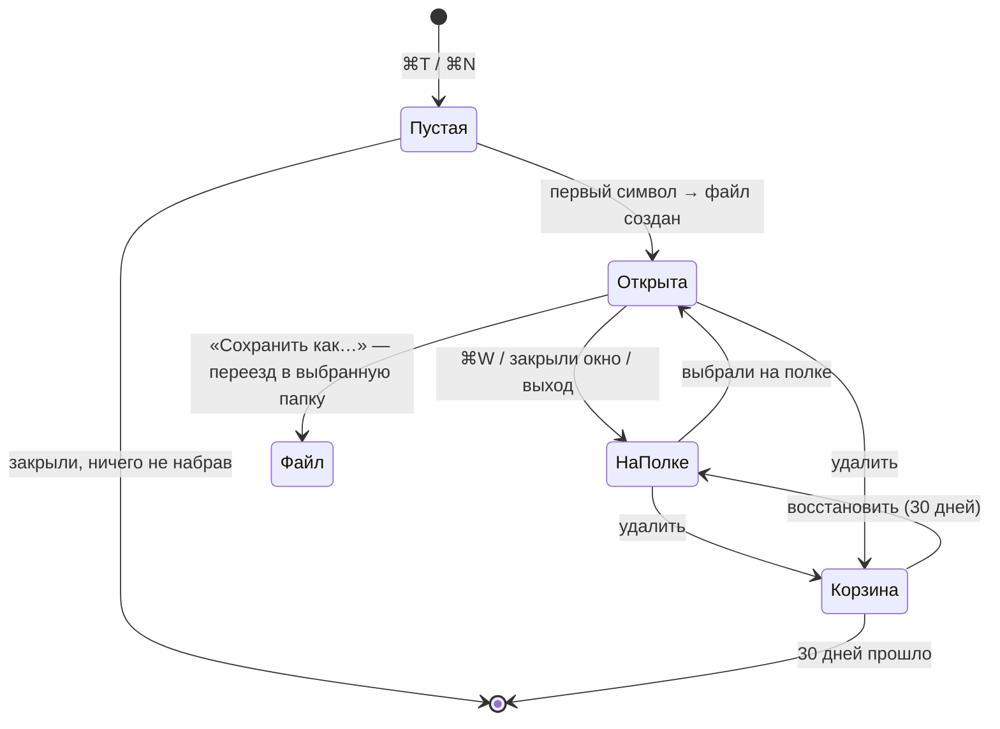

# Полка в couplet — исследование

> 2026-09-26. Повод: после `brew upgrade` (2.0.0 → 2.0.1) пропал untitled с планами. Вопрос Max: может ли couplet сам хранить заметки без имени — так, чтобы их нельзя было потерять и не приходилось думать, куда и под каким именем сохранять.

## Коротко

- **Нужно, и это не выдумка.** Эту же боль уже лечили BBEdit (Notes в версии 14 — прямой ответ на «у меня висит 300+ untitled»), Drafts, Apple Notes и iA Writer. У VS Code и Zed были ровно такие же потери untitled на «перезапуске для обновления».
- **Рекомендация: убрать хрупкий untitled как класс.** Новый документ — это сразу заметка на полке: обычный `.md`-файл, который couplet ведёт сам, с первого введённого символа. Закрыть вкладку значит убрать заметку на полку, а не выбросить. Удалить можно только явно, и удалённое сначала попадает в корзину.
- **Полка общая для всего приложения** и живёт в дровере `⌘J` отдельной секцией, не вперемешку с вкладками. Имени нет: заголовок берётся из первой строки. Кнопки «сохранить» нет: пишется всё само.
- **До полки стоит сделать фазу 0:** сборщик мусора сессии больше никогда не удаляет черновики, а переносит их в корзину на 30 дней. Это полдня работы, и это уже спасло бы ваш план.

## 1. Что сломалось и почему это типовая ошибка

Untitled в couplet — это вкладка с `path: null`, чей текст лежит в `session/draft-<tab_id>.md`. Раз в секунду couplet сохраняет сессию и **удаляет все черновики, на которые она больше не ссылается** (`prune_untitled_files`, `lib.rs:417`). Если при обновлении, миграции или падении хоть одна ссылка потерялась, сборщик мусора превращает это в удаление данных. Копии нет.

Так же падали и другие:

| Приложение | Где держало untitled | Что случилось |
|---|---|---|
| VS Code [#69972](https://github.com/microsoft/vscode/issues/69972), [#70247](https://github.com/microsoft/vscode/issues/70247) | бэкапы, найденные через метаданные сессии | после «Restart to Update» вкладки Untitled вернулись пустыми |
| Zed [#30665](https://github.com/zed-industries/zed/discussions/30665) | SQLite, привязка к воркспейсу | «lost many months of unsaved buffers». Данные остались в базе, пропала только ссылка на них |
| Sublime Text | прямо внутри файла сессии | файл сессии сломался — буферы пропали вместе с ним |

Общее у всех: **пользовательский текст живёт как часть состояния сессии.** Надёжное хранилище так не устроено.

## 2. Как это делают те, кто решил задачу

| | Имя | Где хранится | Как открыть список | Удаление | Выход в файл |
|---|---|---|---|---|---|
| **BBEdit Notes** (ближайший аналог) | из начала текста, `Rename Note` фиксирует | обычные `.md` в пакете в Application Support | отдельное окно с сайдбаром, видны в ⌘D, поиск | в системную Корзину | Save A Copy, Export Notes |
| **Drafts** | первая строка | БД + CloudKit | боковая панель со встроенным поиском | Trash на 30 дней | share / actions |
| **Apple Notes / Bear** | первая строка | БД | сайдбар | Recently Deleted на 30 дней | экспорт |
| **iA Writer** | первая строка → имя файла | обычные файлы в Library | File List | обычное удаление | это и так файлы |
| **Notational Velocity** | заголовок = строка поиска | БД или plain-файлы | одно поле: поиск и создание | — | — |
| **Obsidian Unique note** | timestamp `202609260215` | `.md` в vault | обычный файловый список | — | это и так файлы |
| **Tot** | нет, 7 фиксированных точек | локально + iCloud | одно окно в menu bar | нет | share как .txt |

Мелочь из BBEdit, которую стоит украсть: **«Rescue untitled documents when discarding changes»** — даже после «Не сохранять» снимок текста всё равно остаётся на диске.

## 3. Варианты для couplet

### A. Кнопка «На полку»

Untitled остаётся как есть, а действие «На полку» (`⌘K`) превращает его в заметку.

- Плюс: минимальные изменения, текущая модель «⌘W на untitled выбрасывает текст» не трогается.
- Минус: **не решает исходную проблему.** Вы вели план в untitled не потому, что забыли нажать кнопку, а потому что так проще. Документ, который человек не отложил на полку явно, так и остаётся хрупким.

### B. Untitled — это сразу заметка ✅ рекомендую

`⌘T` / `⌘N` создают заметку. Файл появляется при первом непустом символе, до этого на диске ничего нет.

- Плюс: хрупкого состояния нет вообще, помнить ничего не нужно, класс потерь закрыт целиком.
- Плюс: не нужен даже отдельный жест «отложить» — закрыли вкладку, и заметка на полке.
- Минус: копится мусор из одноразовых набросков. Лекарство: пустые заметки не создаются, полка сортируется по недавности, удаление одним жестом.
- Минус: отменяет ваше решение из спеки вкладок (§8: «⌘W на untitled теряет текст — это фича»). Решать вам, см. вопрос 1.

### C. Scratchpad / слоты в духе Tot

Фиксированные N блокнотов.

- Годится для однодневок, но задачу «не потерять большой план» не решает. Только как дополнение, сейчас не нужно.

## 4. Рекомендуемая механика (вариант B)

**Как откладывать.** Никак, отдельного действия нет. Всё набранное уже лежит на полке. Закрыть вкладку, окно или приложение значит убрать заметку на полку. Отдельный пункт «Отложить» (`⌘K`) нужен только для одного случая: убрать открытую заметку с глаз, не закрывая окно.

**Где хранить.** Обычные `.md`-файлы, по одному на заметку, запись через `atomic_write::save` — то же проверенное сохранение, что и у документов. Два кандидата на папку:

| | `~/Documents/couplet/` ✅ | `~/Library/Application Support/couplet/notes/` |
|---|---|---|
| Видна человеку в Finder | да | нет |
| Spotlight ищет по тексту (сам сможешь найти, если что) | да | нет, `~/Library` не индексируется |
| Переживает `brew uninstall --zap` | **да** | **нет, zap сносит всю папку** |
| Агенты читают без знания внутренностей | да | путь магический |
| Риски | если включена синхронизация «Документы в iCloud», неиспользуемые файлы могут выгружаться из iCloud; с этим надо научиться работать | — |

Рекомендую `~/Documents/couplet/` и пункт «Показать полку в Finder». Сессия хранит **ссылки** на заметки, но не владеет ими: сборщик мусора сессии к этой папке не прикасается ни при каких условиях.

**Имена.** Файл получает стабильное имя, которое не меняется: `2026-09-26-0215-a3f9.md`. Отображаемый заголовок берётся из первого `#`-заголовка или первой строки, как у Drafts, BBEdit и Apple Notes. Файл не переименовываем при правке заголовка, потому что в couplet на путь завязано всё: dedup, комментарии, маршрутизация агентов.

**Как открывать полку.** В дровере `⌘J` появляется вторая секция «Полка» под вкладками окна. Работает поиск в духе NV: набираешь текст — список фильтруется по заголовку и содержимому, Enter открывает. Вызвать дровер сразу в режиме полки можно клавишей `⌘K` (свободна и в меню, и в CodeMirror).

**Глобальная или по окну.** Глобальная. Заметка не принадлежит ни окну, ни проекту: проект в couplet — это git toplevel, а у заметки его нет. Открытая заметка ведёт себя как обычная вкладка: одна на всё приложение, открыта в другом окне — туда и переключаемся.

**Отдельно от вкладок или вперемешку.** Отдельно. Вкладки — это то, что сейчас открыто, полка — то, что хранится. Смешать их — значит снова размыть разницу между «на виду» и «сохранено», из-за которой всё и случилось. Открытая заметка показывается в полке с меткой «открыта в #N».

**Механика сохранения.** Кнопки нет: автосохранение как у файлов, в тех же тактах. В карточке вкладки маленькая метка «на полке» вместо «Untitled». «Сохранить как…» (`⌘⇧S`) — выход в обычный файл: заметка переезжает в выбранную папку и уходит с полки.

**Удаление.** Только явное: пункт меню или Delete на полке. Удалённое переезжает в `.trash/` внутри папки полки и 30 дней восстанавливается из секции «Удалённые». Системная Корзина тоже подошла бы, но из приложения её не пролистаешь.

**Агенты.** Заметки — это файлы, поэтому существующие `show`/`edit` работают с ними по пути без переделок. Позже можно добавить аналог `bbedit --note`: `couplet note` через stdin кладёт текст на полку. Это в духе couplet: ИИ получает те же глаголы, что и человек.

## 5. Фаза 0 — страховка, которую стоит сделать сразу

Независимо от полки, одним маленьким PR:

1. **Сборщик мусора больше не удаляет, а переносит.** `prune_untitled_files` перемещает черновик в `session/.trash/` с датой, чистка через 30 дней. Ваш план сейчас лежал бы там.
2. **Rescue-снимок при `⌘W` на untitled** (как в BBEdit), пока полки нет.
3. **Найти и починить причину** потери ссылок при обновлении. Кандидаты: выход через AppleEvent `quit` от cask записал сессию без черновиков, или окно «что нового» при смене версии перебило восстановление сессии.
4. Правило в CLAUDE.md: **текст пользователя никогда не удаляется без второй копии.**

## 6. Что это меняет в принятых решениях

- Спека вкладок §8: «⌘W на untitled теряет текст — это фича» заменяется на «⌘W убирает на полку».
- `closed.rs`: стек `⌘⇧T` по-прежнему для файлов; у заметок есть путь, так что они попадут туда сами.
- Пункт «Открыть окна прошлой сессии» остаётся, но теряет роль единственного способа спасти untitled.

## 7. Чего не делать (YAGNI)

Теги, папки внутри полки, синхронизация, отдельное окно заметок, версии каждой правки. Полка — плоский список по недавности с поиском. Если через месяц этого станет мало, будет понятно, чего именно не хватает.

## 8. Вопросы к тебе

1. **Вариант B** (untitled = заметка, `⌘W` убирает на полку) или **A** (untitled остаётся хрупким, плюс кнопка «На полку»)?
2. **Папка:** `~/Documents/couplet/` (видна, Spotlight, переживает zap) или скрытая Application Support?
3. **Полка в дровере `⌘J`** отдельной секцией, или хочется отдельный вход, например `⌘K` сразу в полку?
4. **Фазу 0** (сборщик мусора → корзина + причина потери) делаем сейчас, до полки?

## Источники

- BBEdit 14 Notes — [release notes](https://www.barebones.com/support/bbedit/notes-14.0.html), [TidBITS](https://tidbits.com/2021/07/21/bbedit-14-adds-simple-notes-management/), rescue untitled — [BBEdit 13.5](https://mjtsai.com/blog/2020/10/14/bbedit-13-5/)
- Drafts — [new drafts & pinning](https://docs.getdrafts.com/docs/editor/new-drafts-and-pinning), [version history](https://docs.getdrafts.com/docs/drafts/versionhistory)
- Apple Notes, Recently Deleted — [support.apple.com](https://support.apple.com/guide/notes/delete-a-note-not5585d71a8/mac)
- iA Writer Library — [ia.net](https://ia.net/writer/support/ios/the-library)
- Obsidian Unique note — [help.obsidian.md](https://help.obsidian.md/plugins/unique-note)
- Notational Velocity — [notational.net](https://notational.net/)
- Tot — [Iconfactory blog](https://blog.iconfactory.com/2020/02/meet-tot-your-tiny-text-companion/)
- VS Code hot exit — [blog](https://code.visualstudio.com/blogs/2016/11/30/hot-exit-in-insiders), потери: [#69972](https://github.com/microsoft/vscode/issues/69972), [#70247](https://github.com/microsoft/vscode/issues/70247), [#94023](https://github.com/microsoft/vscode/issues/94023), [#114022](https://github.com/microsoft/vscode/issues/114022)
- Zed — [#30665](https://github.com/zed-industries/zed/discussions/30665), [#16336](https://github.com/zed-industries/zed/issues/16336), [#8958](https://github.com/zed-industries/zed/issues/8958)

Не проверено: корзина и версии Simplenote, файл `Auto Save Session` в Sublime, срок хранения untitled в iCloud.
