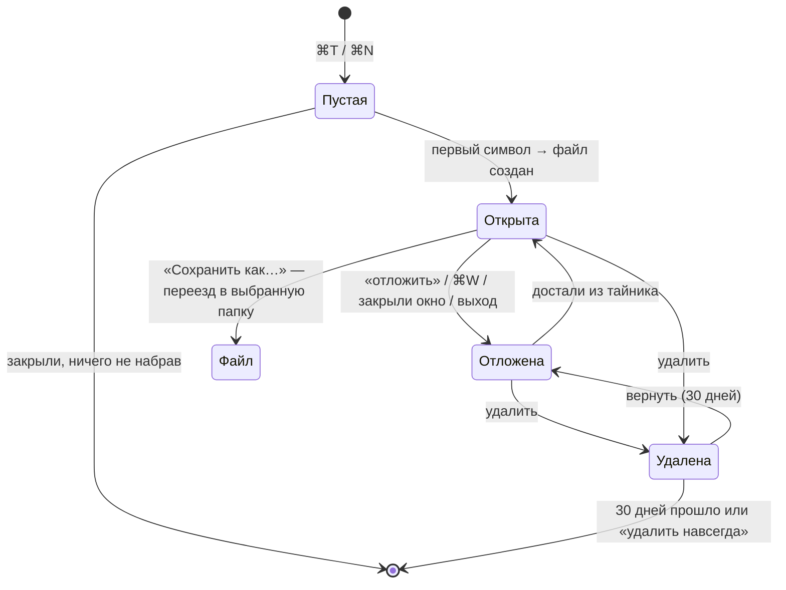

# Тайник (stash) — итоговое описание

> Эталон интерфейса — макет `docs/investigations/2026-09-26-stash-mockup/stash-drawers.html` (git-тег `stash-mockup-approved`). Споры о виде решает макет, о поведении — этот документ. Исследование и история решений — `docs/investigations/2026-09-26-shelf/report.md`.

## Суть

couplet сам хранит всё, что человек набрал, — без имени файла и без выбора папки. Хрупкого untitled больше нет: любой документ с текстом лежит в **тайнике** (англ. **stash**) и не может пропасть при закрытии, падении или обновлении.

## Модель

### Что лежит в тайнике

| | Заметка | Ссылка на файл |
|---|---|---|
| Текст | `.md`-файл в папке тайника, им владеет couplet | файл остаётся где был, couplet его не меняет |
| Как попадает | сама, с первого непустого символа | жестом «отложить» или тегом |
| Удалить | в корзину на 30 дней | удаляется только ссылка, файл на месте |
| Тег репо | проект окна при создании, хранится | git toplevel пути, вычисляется |

- **Пустой документ** при закрытии просто исчезает — хранить нечего.
- **Открытый файл сам в тайник не попадает.** Файлы попадают только по жесту человека: «отложить» или поставить тег. Тег на файле = отложить его в тайник.
- **Дедупликация.** Один документ — одна запись. Ключ файла — нормализованный путь (`path_norm`), уникальный индекс в базе. Повторно отложить лежащий документ — поднять его наверх, слить теги, обновить каретку; вторая запись не создаётся.
- **Файлы пользователя не трогаем:** никаких тегов и frontmatter внутри файлов.
- **Битая ссылка** (файл перемещён или удалён вне couplet) — карточка «файл не найден» с действиями «найти» и «убрать».

### Жизненный цикл заметки

**«Отложить»** — явный жест: убрать документ с глаз, но оставить под рукой. Закрывает вкладку и кладёт документ в тайник с отметкой времени. Для файла создаёт ссылку.

### Теги

- Несколько тегов на документ.
- **Тег репо** ставится автоматически. Окно проекта открывает тайник уже отфильтрованным по своему репо; фильтр снимается крестиком на чипе. В окне без проекта видно всё.
- В строке поиска `#тег` фильтрует по тегу, остальной текст — по заголовку и содержимому.

### Поиск

Один поиск на всех — человек в дровере и агент через `stash_search` получают одинаковые результаты из одного индекса.

- **Триграммный.** Индекс FTS5 с токенайзером `trigram`: ищет по кускам слова, поэтому находит любые словоформы («тайник» → «тайника», «тайнике») и кусок посреди слова («мент» → «документ»). Регистр не важен.
- **Ранжирование** по релевантности (bm25): совпадение в заголовке весит больше, чем в тексте; при равенстве — свежее отложенное выше.
- **Язык запроса:** обычный текст, `#тег`, фраза в кавычках — всё можно сочетать.
- **Короче трёх символов** триграммы не работают: такой запрос ищет по заголовкам простым вхождением.
- **В дровере у человека:** фильтр по мере набора, найденное место подсвечено в превью карточки, в превью показан фрагмент вокруг совпадения, а не начало текста.

### Имена

- Файл заметки получает стабильное имя, которое не меняется: `2026-09-26-0215-a3f9.md`.
- Заголовок для показа — первый `#`-заголовок или первая строка.

## Хранение

| Что | Где | Роль |
|---|---|---|
| Записи тайника, теги, время «отложено», ссылки на файлы, тег репо, ключи дедупликации | SQLite, `Application Support/couplet/stash.db` | источник правды |
| Текст заметок | `.md`-файлы в `~/Documents/couplet/` (dev: `~/Documents/couplet-dev/`), запись через `atomic_write::save`; путь в БД | данные |
| Поиск: полнотекстовый индекс FTS5 с токенайзером `trigram` (заголовок + текст), позже векторы (`sqlite-vec`) | та же SQLite | производное, пересобирается |

- Изменения нескольких записей — одной транзакцией.
- Ежедневный онлайн-бэкап базы в `backups/`, последние 7; плюс плоский `.stash-export.json` рядом с заметками.
- База не лежит в iCloud-синхронизируемых папках.
- Ни одного удаления без корзины. Сессия ссылается на заметки, но не владеет ими: сборщик мусора сессии тайник не трогает.
- Зависимость: `rusqlite` (`bundled`).

## Интерфейс

### Дровер вкладок

- **Нижняя область.** В покое — кнопка «Тайник» и сводка «19 · отложено сегодня 6». Пока тащишь вкладки — зона сброса «Отложить в тайник · N вкладок».
- **Отметка тайника.** У заметки в карточке вкладки и в заголовке окна — яркий значок тайника у названия. Больше ничего («в тайнике» не пишем).

### Дровер тайника

- Открывается справа кнопкой «Тайник» (или `→` из дровера вкладок). Зеркало дровера вкладок, своего цвета — производного от цвета ссылок темы.
- **Один список**, без секций. Сортировка: «изменение ⌘L · открытие ⌘R · тип ⌘U»; по умолчанию «изменение» — недавно отложенное сверху.
- **Карточка:** значок вида (заметка / файл), заголовок, яркая строка «отложено только что / сегодня 01:55 / вчера…», у файла — репо, ветка и путь, превью, чипы тегов (тег репо — пунктирный).
- **Удаление:** у заметки — «удалить» (в корзину), у файла — «убрать из тайника».
- **Корзина.** Внизу дровера — «Удалённые · N · хранятся 30 дней». Переключает дровер в режим корзины: карточки приглушены, «удалится через N дн.», действия «вернуть» (в тайник с тегами, наверх) и «удалить навсегда». Назад — «← в тайник» или Esc. В корзину попадают только заметки.

### Оба дровера вместе

- **Открыты одновременно.** Страница за ними размыта и затемнена так же сильно, как при карусели окон.
- **Перенос.** Документ, открытый вкладкой в этом окне, в тайнике этого окна не показывается. Тайник → вкладки — открыть; вкладки → тайник — отложить; карточка уходит с одной стороны и появляется на другой. Документ, открытый в другом окне, виден с пометкой «открыта в #N»; открыть его отсюда — перенести из того окна.
- **Никогда не перекрываются.**
  - Окно шире 960px: обычные ширины (вкладки 420px, тайник 400px), между ними видна страница и может появиться карусель окон.
  - 680–960px: оба рядом, по `(100% − 40px) / 2`, не уже 320px, компактные карточки; карусель здесь не появляется.
  - Уже 680px: при открытии тайника окно само раздвигается (упирается в правый край экрана — сдвигается влево) и возвращается к прежнему размеру и месту при закрытии. Тост: «Окно раздвинулось, чтобы тайник встал рядом · вернётся, когда тайник закроется». Полноэкранное окно и Split View не трогаем.
- **Фокус.** `←`/`→` переключают дровер в фокусе. Фокус виден только по светящемуся ободку (у вкладок — фиолетовый акцент, у тайника — его цвет); дровер без фокуса не приглушается.

### Клавиатура

| Клавиша | Действие |
|---|---|
| `⌃T` | отложить текущий документ |
| `⌃S` | открыть или закрыть тайник сразу, с любого места (открывает оба дровера, фокус на тайнике) |
| `←` / `→` | фокус между дроверами; `→` из дровера вкладок открывает тайник |
| набор текста | фильтр дровера в фокусе |
| Esc | сначала сбросить поиск, потом закрыть дровер в фокусе; закрытие дровера вкладок закрывает оба |
| `⌘L` / `⌘R` / `⌘U` | сортировка в дровере в фокусе |

- **`⌃T` и `⌃S` — обработчики на странице, не пункты меню:** Ctrl-only акселератор меню с клавиатуры не срабатывает (CLAUDE.md, выяснено 2026-09-25). Регистрируются в capture-фазе рядом с `ctrlDigitHandler` / `ctrlTabHandler`, матчатся по `e.code` (`KeyT`, `KeyS`). В меню пункты есть, но без клавиши. `⌃T` отнимает у CodeMirror `transposeChars` — сознательно.
- **`/stash`** в slash-меню — отложить текущий документ и поставить теги.

## Агент

Агенту никогда не отдаётся весь тайник: он ищет, видит короткие совпадения и забирает текст только нужной записи.

| Метод (MCP и CLI) | Что отдаёт | Объём |
|---|---|---|
| `stash_search(query, tag?, kind?, repo?, all?, limit=10, cursor?)` | лучшие совпадения по релевантности: id, заголовок, вид, теги, время «отложено», сниппет с найденным местом (~200 символов); **без полного текста** | 10 по умолчанию, `total` и курсор следующей страницы |
| `stash_list(tag?, repo?, kind?, since?, sort?, all?, limit=20, cursor?)` | только метаданные, **никогда текст** — «что откладывал вчера», «всё с #infra» | постранично, с `total` |
| `stash_get(id, lines?)` | полный текст одной заметки (для большой — диапазон строк) или путь файла | одна запись |
| `stash_add(text \| path, tags?)` | новая заметка из текста (в CLI — через stdin) или ссылка на файл | — |
| `stash_tag(id, add?, remove?)` | поставить или снять теги | — |

- **Область по умолчанию — репо текущей папки агента**, как окно проекта само фильтрует тайник. `all: true` ищет по всему тайнику.
- Поиск тот же, что у человека (раздел «Поиск»): триграммы, bm25, `#тег`, фразы.
- Позже тот же `stash_search` получит `mode: "semantic"` / гибридный режим на эмбеддингах — интерфейс для агента не меняется.
- CLI для агентов без MCP: `couplet stash search "HDMI переговорка" --tag infra --limit 5 --json`, `couplet stash get <id>`.
- Заметки — обычные файлы, поэтому `show`, `edit` и комментарии работают с ними по пути.

## Что меняется в принятых решениях

- Спека вкладок §8: «⌘W на untitled теряет текст» → «⌘W откладывает в тайник».

## Не делаем сейчас

Быстрые теги по клавише, синхронизация, папки внутри тайника, отдельное окно, история версий, семантический поиск (embeddings — отдельная фаза, база к нему готова).

## Решения, закрытые 2026-09-27

- **Папка заметок — `~/Documents/couplet/`**: видна в Finder, ищется Spotlight, переживает `brew uninstall --zap`. Для dev-сборки — отдельная папка (`~/Documents/couplet-dev/`), чтобы dev не писал в заметки установленного приложения.
- **`⌃T` — отложить, `⌃S` — открыть тайник сразу.**
- **Фаза 0** (сборщик мусора сессии переносит черновики в корзину вместо удаления + причина их потери при обновлении) — первым этапом плана реализации.
